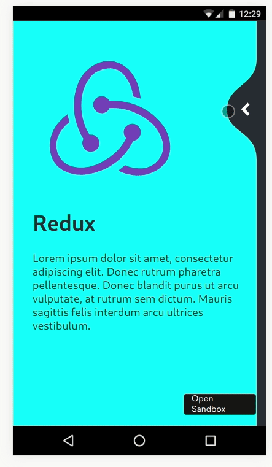

One of my favourite things to do to push my React skills and to try out new things is to try to reproduce bits of UI that I see on the internet, particularly animations. I find that a lot of React tutorials, particularly animation ones, cover basics, but not the bits that are used in real apps, so I like to share what I find!



_Quite glitchy slow gif of the end result - try for yourself at the bottom!_

I first saw this animation on the wonderful [Can it be done in React Native?](https://www.youtube.com/watch?v=gLopy2MCAqM) series on YouTube, but it was based on [this concept from Cuberto](https://twitter.com/cuberto/status/1083060891657125889).

What really interested me here was the smooth curve and the snapping. I could see how to do the text colour switching as the curve passed over it, from the [Chrome Tabs](https://www.youtube.com/watch?v=uH7am5ewY8M) example I've looked at before.

Fortunately, [Cuberto made their version open source](https://github.com/Cuberto/liquid-swipe). In addition, I could look at [William Candillon's version from his YouTube channel](https://github.com/wcandillon/can-it-be-done-in-react-native/blob/master/season3/src/LiquidSwipe). Even so, it wasn't straightforward.

## Tools
Getting the text colour to cut at the point where the curve crosses it is going to require the use of masking, like we used in [Chrome Tabs](https://www.youtube.com/watch?v=uH7am5ewY8M). I remembered from reading documentation for that that the mask could be an SVG path, rather than just a box. Both Cuberto and wcandillon's versions use SVG paths to do create their curve shapes, so SVG seems to be the way to go. We know that SVG isn't the most performant, but it seems like we need its power here.

The gesture is all based on dragging or clicking. We're going to be animating the SVG path in response to the drag/click state, so this needs to be in JavaScript-land (see previous posts). To avoid the DOM render loop, we'll use our favourite react-spring. Fortunately, this takes some API hints from the React Native Animated API, so we can reuse bits from wcandillon's React Native version. We can also use react-spring's companion library react-use-gesture to drive the springs.

As ever, I use a starter based on `create-react-app`, with my preferred dev tools (prettier...) and `styled-components` for CSS.

## Getting Started
To get the basic layout, we just two basic content pages, one on top of the other - we'll then show part of the top one based on the gesture state.

```ts
const ContentWrapper = styled.div`
  position: absolute;
  top: 0;
  left: 0;
  right: 0;
  bottom: 0;
  padding: 32px;
  display: flex;
  flex-direction: column;
  user-select: none; /** So we don't accidentally select text while dragging */
`
const Image = styled.img`
  height: 250px;
  width: 250px;
`
const Title = styled.h1``
const Description = styled.span``
type Props = {
  image: string
  title: string
}
const Content = ({ image, title }: Props) => (
  <ContentWrapper>
    <Image src={image} />
    <Title>{title}</Title>
    <Description>
      Lorem ipsum dolor sit amet, consectetur adipiscing elit. Donec rutrum
      pharetra pellentesque. Donec blandit purus ut arcu vulputate, at rutrum
      sem dictum. Mauris sagittis felis interdum arcu ultrices vestibulum.
    </Description>
  </ContentWrapper>
)
```

I use the following CSS snippet a lot. It's equivalent to the React Native `absoluteFill` stylesheet.
```css
.absoluteFill {
  position: absolute;
  top: 0;
  left: 0;
  right: 0;
  bottom: 0;
}
```

Then we can put two of those on top of eachother in the App component:
```ts
const AppHeader = styled.header`
  background-color: #282c34;
  min-height: 100vh;
  display: flex;
  flex-direction: column;
  font-size: calc(10px + 2vmin);
  color: white;
  position: relative;
`

const Overlay = styled.div`
  position: absolute;
  top: 0;
  left: 0;
  right: 0;
  bottom: 0;
  background-color: aqua;
  color: #282c34;
`
const App = () => {
  return (
    <AppContainer>
      <GlobalStyle />
      <AppHeader>
        <Content image={reactLogo} title="React" />
        <Overlay>
          <Content image={reduxLogo} title="Redux" />
        </Overlay>
      </AppHeader>
    </AppContainer>
  )
}
```

We can now inspect and see that we have the two pages on top of eachother, with the "Redux" page on top having a different text and background colour - this represents the wave on top.

## Start the Wave
For the Wave, we need to calculate an SVG path, then set that as the `clip-path` for the `Overlay` element ([see MDN](https://developer.mozilla.org/en-US/docs/Web/CSS/clip-path)). We showed in the Chrome Tabs example that we could use react spring to set the clip path as a style interpolated from an animated value, so we can do that again.

To start off, we need a function to calculate our wave path based on our drag point. We also have different curves based on which direction we're going in. Fortunately, wcandillon [already converted](https://github.com/wcandillon/can-it-be-done-in-react-native/blob/master/season3/src/LiquidSwipe/Weave.tsx) Cuberto's Swift code to JavaScript, so with a few tweaks for just building a string, we can use most of it straight off. The code for these is in `waveHelpers.ts` and `wavePath.ts`. We also need a way of calculating out progress across the screen as a fraction. This is a standard interpolation of the cursor point (`x`) in the range of 0 to the viewport width, with different clamping for where the wave snaps across. This is in `progress.ts`.

We need the viewport height and width as imports to the wave functions. Fortunately there are lots of libraries for doing this in React, we'll use `use-viewport-sizes` because it's nice and simple.

We can wire these up with the initial resting value to validate that the wave is correct, and try a few other values to see its progress:
```ts
// Initial values - all the way to the right, halfway up
const xy = [vpWidth, vpHeight / 2];
const isForward = true;

const [x, y] = xy;
const progress = calculateProgress(x, vpWidth, isForward)
const clipPath = buildWave({
  centerY: y,
  horRadius: isForward
    ? calculateHorRadiusForwards(vpWidth, vpHeight)(progress)
    : calculateHorRadiusBackwards(vpWidth, vpHeight)(progress),
  vertRadius: calculateVertRadius(vpWidth, vpHeight)(progress),
  sideWidth: calculateSideWidth(vpWidth, vpHeight)(progress),
  width: vpWidth,
  height: vpHeight,
})

...

<Overlay style={{ clipPath }}>
  <Content image={reduxLogo} title="Redux" />
</Overlay>
```
By fiddling with the `xy` and `isForward` values, I can see the wave for my finger being at different points, and with snapping from different sides (this was how I made sure that the wave calculation functions were correct).

## Connecting up the drag
The `x` and `y` in the earlier examples are supposed to represent the user's finger/cursor position when dragging. To do this, we want them to be represented by animated values rather than numbers (this allows react-spring to skip the full React render/reconciliation cycle, which we don't want to do each frame).

The documentation for `react-use-gesture` explains how to do this, along with many of the dragging examples on the react-spring website.
```ts
const [props, set] = useSpring(() => ({xy: [vpWidth, vpHeight / 2]}));
const bind = useDrag(({ xy }) => {
  set({ xy })
})
const isForward = true;

const clipPath = props.xy.interpolate((x: number, y: number) => {
  const progress = calculateProgress(x, vpWidth, isForward)
  return clipPath = buildWave({
    centerY: y,
    horRadius: isForward
      ? calculateHorRadiusForwards(vpWidth, vpHeight)(progress)
      : calculateHorRadiusBackwards(vpWidth, vpHeight)(progress),
    vertRadius: calculateVertRadius(vpWidth, vpHeight)(progress),
    sideWidth: calculateSideWidth(vpWidth, vpHeight)(progress),
    width: vpWidth,
    height: vpHeight,
  })
})

...

<AppHeader {...bind()}>
  <Content image={reactLogo} title="React" />
  <Overlay style={{ clipPath }}>
    <Content image={reduxLogo} title="Redux" />
  </Overlay>
</AppHeader>
```

`props.xy` is a compound animated value of the x and y positions (rather than numbers), so instead of directly using them, we need to use the interpolate functionality. The returned `clipPath` is not an actual string, it's an animated value itself, so we need Overlay to be a `styled(animated.div)` rather than just a `styled.div`.

As we drag around, we can now see that the curve moves with us. However, when we release, it doesn't snap to either side. We're also missing the button to manually switch from one side to another.

## Get Snappy
The React Native version used the `snapPoint` helper from `react-native-redash` to choose where to snap to. Fortunately, it's about [15 lines of JavaScript](https://github.com/wcandillon/react-native-redash/blob/a9a614bd75b30225b15bf6935fe9bc1e93e2e000/packages/core/src/Animations.ts#L113), so we can borrow that.

The inputs to this function are a current position, a velocity in that axis, and the snap points to go between. We already have the current position (`x`) and `useDrag` can also provide us with the velocity. The snap points are 0 and the width of the viewport. We only want to snap when we're not actually dragging, which `useDrag` can also provide with the `active` flag.

```ts
const bind = useDrag(({ xy, vxvy, active }) => {
  if (active) {
    set({ xy })
  } else {
    const snapPoint = chooseSnapPoint(xy[0], vxvy[0], [0, vpWidth])
    set({ xy: [snapPoint, xy[1]] })
  }
})
```

At this point, we also want to be able to start toggling the direction. I'm going to handle this as a number rather than a boolean, partly to keep this version of react-spring's type definitions happier, partly because it would allow the further extension to more than 2 pages.
```ts
const [props, set] = useSpring(() => ({
  xy: [vpWidth, vpHeight / 2],
  isForward: 1,
}))
const bind = useDrag(({ xy, vxvy, active }) => {
  if (active) {
    set({
      xy,
    })
  } else {
    const snapPoint = chooseSnapPoint(xy[0], vxvy[0], [0, vpWidth])
    set({
      xy: [snapPoint, xy[1]],
      isForward: snapPoint / vpWidth,
    })
  }
})

...

const clipPath = props.xy.interpolate((x: number, y: number) => {
  const isForward = props.isForward.getValue() > 0.5
  const progress = calculateProgress(x, vpWidth, isForward)
  return clipPath = buildWave({
    centerY: y,
    horRadius: isForward
      ? calculateHorRadiusForwards(vpWidth, vpHeight)(progress)
      : calculateHorRadiusBackwards(vpWidth, vpHeight)(progress),
    vertRadius: calculateVertRadius(vpWidth, vpHeight)(progress),
    sideWidth: calculateSideWidth(vpWidth, vpHeight)(progress),
    width: vpWidth,
    height: vpHeight,
  })
})
```

With that, we're most of the way there! Our wave now moves with our finder and snaps to either side.

## Button
If we look at the motion of the button, it doesn't precisely follow the wave; it follows the drag slightly independently of the wave. This is good news! It means we don't need to make any changes to wave for the button. The button also fades out as it moves across, and clicking it automatically snaps it.

The position of the button is just a function of the drag position and the viewport width. The opacity is just a function of the `x` drag position and the viewport width. That means we can just use the existing `props.xy` animated value and do more interpolating!

To animate the button smoothly, we just want to be animating easy to animate properties - `transform` and `opacity`. So the button uses `position: absolute` and the transform dictates its position. The `y` position of the button is simple - it follows the y drag position, with just an offset for the button size to get it centred.

The `x` position of the button is more complicated. When the finger/cursor is all the way to the right, it should be a bit off the right edge of the viewport. Towards the left, it fades out, but in general it gets close to the finger/cursor. This is therefore an interpolation inside the interpolate - fortunately we have a quick interpolation function to hand. Based on some trial and error, we get:
```ts
const transform = xy.interpolate((x: number, y: number) => {
  return `translate3d(${interpolate(
    x,
    [0.5 * vpWidth, vpWidth],
    [0.5 * vpWidth, vpWidth - BUTTON_SIZE - 8],
    true
  )}px, ${y - BUTTON_SIZE / 2}px, 0)`
})
```

For the opacity, again we're just interpolating the finger/cursor `x` position, based on `vpWidth`. We also know it fades out before it hits the `0.5 * vpWidth` stop we included in the transform. A bit more trial and error gives:
```ts
const opacity = xy
  .interpolate((x: number, y: number) => x)
  .interpolate({
    range: [0.7 * vpWidth, vpWidth],
    output: [0, 1],
  })
```

Put these together in a `style` prop for an `animated.button`, and we've got a button to follow our finger.

The click handler is going to be very similar to the drag handler when the drag finishes. However, it's even simpler, as we can only snap in one direction with the button. We can keep the most recent `y` value by using the current value in our `set`.
```ts
const handleButtonClick = () => {
  set({ xy: [0, props.xy.getValue()[1]], isForward: 0 })
}
```


## Browser testing
This all now works great in Firefox. But we really want to check how mobile devices handle the animation, whether or not the wave nicely follows a dragging finger. I fired it up in Chrome on my Nexus 5X and... nothing. The animation doesn't work at all. Cue a lot of head scratching and looking into how to debug mobile Chrome.

I then gave it a go in Chrome on my laptop, and still no dice. A [quick look on CanIUse](https://caniuse.com/#feat=css-clip-path) (and actually the bottom of the MDN docs about clip path) shows that Chrome doesn't support masking by a path supplied in a style tag or CSS. Actually, only Firefox really does. Fortunately, there's a workaround - the `url()` syntax. Combine that with some vendor prefixing (which styled-components does for us) and we can reach 94% of users. Close enough for this (in a real product we'd need to find a decent failure mode).

So rather than setting the clipPath on the `Overlay`, we set it as a definition in an SVG and refer to it by id.
```ts
const Overlay = styled.div`
  position: absolute;
  top: 0;
  left: 0;
  right: 0;
  bottom: 0;
  background-color: aqua;
  color: #282c34;
  clip-path: url(#overlay);
`
...

<svg height="0" width="0" style={{ position: 'absolute' }}>
  <defs>
    <clipPath id="overlay">
      <animated.path d={clipPath} />
    </clipPath>
  </defs>
</svg>
```

Anything within the `defs` section of an SVG is just a definition for use by reference by other elements. If we wanted multiple of these sort of animations in our app, we could be using something to generate unique IDs for the path.

With this change, it works on desktop Chrome. It _sort of_ works in mobile chrome, but the URL bar which appears and disappears as you drag makes it imperfect. We can disable that with the [`touch-action`](https://developer.mozilla.org/en-US/docs/Web/CSS/touch-action) CSS property (props to [Alex Holachek](https://alex.holachek.com/) for this). This actually has a massive impact on mobile performance, because we're no longer resizing the viewport as we drag, so we don't go through the React render/reconciliation loop. We could also tidy it up by making it immediate rather than springy when the drag is active; this is more of a personal taste thing.

## Finished product
I'm really happy with how this has come out. On my Nexus 5X, this is now really smooth. I might dig out my original Nexus 5 and see if it's still smooth there.

The code is here on CodeSandbox - try it out!
_It's better when you actually open it, rather than in an iframe within an iframe..._
<iframe
     src="https://codesandbox.io/embed/busy-murdock-oex5z?fontsize=14&hidenavigation=0&module=%2Fsrc%2FApp.js&theme=light"
     style="width:100%; height:700px; border:0; border-radius: 4px; overflow:hidden;"
     title="busy-murdock-oex5z"
     allow="accelerometer; ambient-light-sensor; camera; encrypted-media; geolocation; gyroscope; hid; microphone; midi; payment; usb; vr; xr-spatial-tracking"
     sandbox="allow-forms allow-modals allow-popups allow-presentation allow-same-origin allow-scripts"
   ></iframe>
